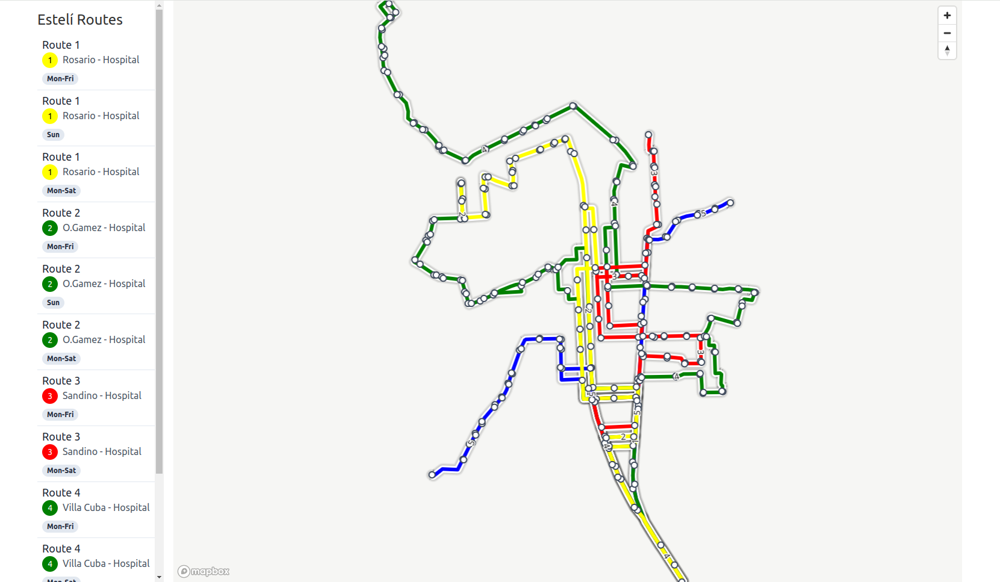
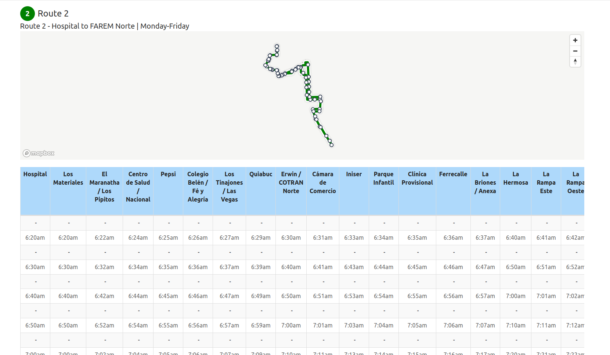
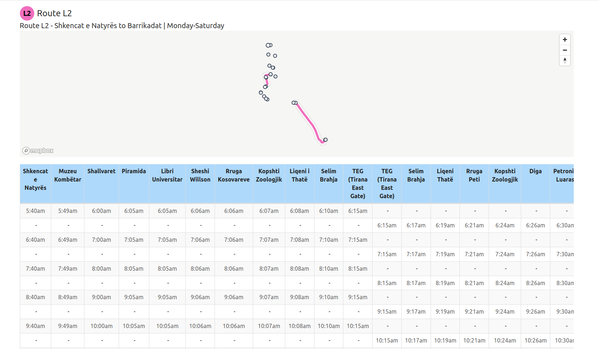
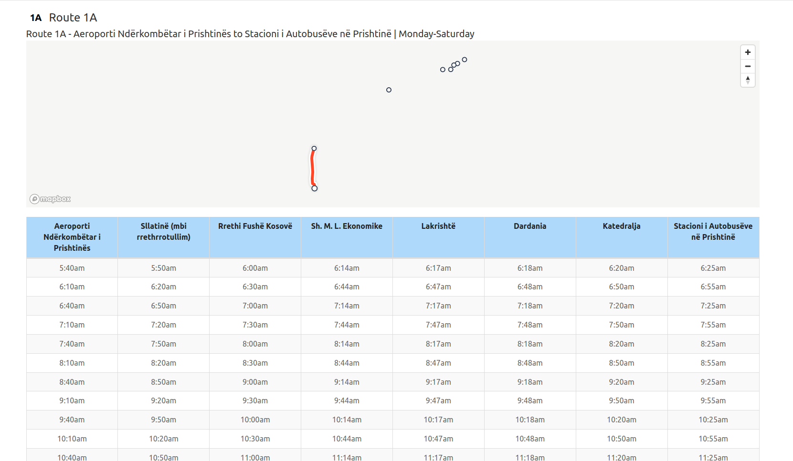

# osm-generated-gtfs

Tools in usage:

- https://github.com/mapanica/easy-timetable-generator  <-- decide on frequencies
- https://github.com/Jungle-Bus/osm2gtfs   <-- generate trips


Visualizations:
- https://gtfs-validator.mobilitydata.org/ <-- get report on GTFS validity
- https://github.com/blinktaginc/gtfs-to-html <-- render schedules and map - https://run.gtfstohtml.com/

<br><hr><br>

### Setup

Prepare environment

```sh
#!/bin/sh
python3 -m venv venv

# keep things separate
mkdir tools
cd tools
```

### From Frequency get timetable

```sh
git clone https://github.com/mapanica/easy-timetable-generator 
# cd easy-timetable-generator
# cp data/example .

# creating schedules
python3 tools/easy-timetable-generator/convert.py -f tirana
cp -r data/* ../results/frequency2timetable/
```

### Create GTFS

```sh
git clone https://github.com/Jungle-Bus/osm2gtfs
cd osm2gtfs

# check issues if Via not proper
# read below common issues

# clean previous data
rm -rf data

osm2gtfs -c results/tirana/config.json > results/osm-issues/logging.tirana.txt 2>&1
# osm2gtfs -c results/prishtina/config.json > results/osm-issues/logging.prishtina.txt 2>&1
```


## Notes on possible issues

- Make sure OSM data is correct:
    - Order of Stations is correct 
    - From and To is same to From and To that you have defined in the frequencies table
    - Via is defined (in case no error comes up - might be related to this) 
- Make sure you have cleaned up after error in osm2gtfs
    - the data is cached under data/ - `rm -rf data/al_*`
-  python3 unpickling.py - for debugging routes


```python
            # trip via removed in trip creator
            trip_via = trip["via"] if "via" in trip else None
            if (trip_fr == itinerary.fr and
                    trip_to == itinerary.to and
                    # trip_via == itinerary.via and
                    service in trip_services):
                for stop in trip["stations"]:
                    stops.append(stop)
                break
```


### Sneak Peek


| Example| Example per line |
| --|--|
|  |  |
| **Tirana - L2** | **Prishtina - L1A** |
|  |  |


