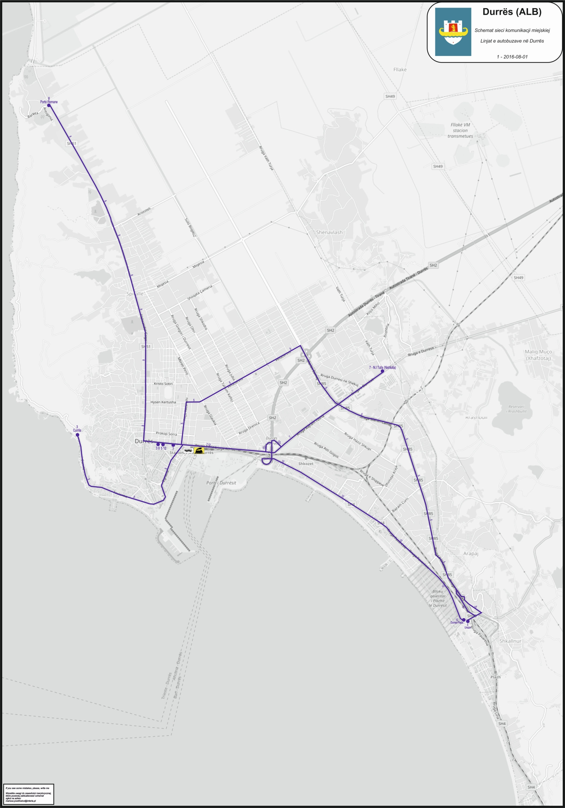

# Lines

**Linjat qytetase të transportit publik në Durrës: itineraret, stacionet, oraret dhe frekuencat e tyre**

### DURRЁS ▪ PLEPA ▪ DURRЁS
 
- Orari: 
  - 05:00 – 23:00
  - Gjate sezonit të verës orari: 05:00-24:00 (1 Maj – 30 Shtator)
- Frekuenca: çdo 6 minuta
- Stacionet e nisjes: Stacioni Sheshi Pranvera, Galaktiku, Ura e Dajlanit, Agip, Teuta, Oficina e Trenit, Xixa, Hekurudha, Tregu, Iliria, Blloku, Blloku, Plepat.
- Stacionet e kthimit: Plepat, Blloku, Blloku, Iliria, Tregu, Hekurudha, Xixa, Oficina Trenit, Teuta, Agip, Ura e Dajlanit, Galaktiku, Ujësjellësi, Stacioni i Trenit, Stacioni Sheshi Pranvera

### DURRЁS ▪ UNAZЁ ▪ KЁNETЁ ▪ PLEPA ▪ DURRЁS
 
- Orari:
  - 05:00 – 23:00
  - Gjate sezonit të verës orari: 05:00-24:00 (1 Maj – 30 Shtator)
- Frekuenca: çdo 20 minuta
- Stacionet e nisjes: Stacioni Sheshi Pranvera, Shkolla “Marie Kaçulini”, Kryqëzimi Stadiumi, Rotondo, Kisha, Mbikalimi i Kënetës, Oxhaku, Mbikalimi, Ish N.SH.N, Lavazh, Kasa, Mitraloz, Bregu i Kanalit, Arapaj, Shkallnur, Plepa
- Stacionet e kthimit: Plepa, Shkallnur, Arapaj, Bregu I Kanalit, Mitraloz, Kasa, Lavazh, Ish N.SH.N, Mbikalimi, Oxhaku, Mbikalimi i Kënetës, Kisha, Rotondo, Kryqëzimi Stadiumi, Shkolla “Marie Kaculini”, Stacioni Sheshi Pranvera.

### DURRЁS ▪ PORTO ▪ ROMANO ▪ DURRЁS 

- Orari:
  - 05:00 – 23:00
  - Gjate sezonit të verës orari: 05:00-24:00 (1 Maj – 30 Shtator)
- Frekuenca:
    - Nga ora: 05:30 – 08:30 dhe 12:00 – 18:00, frekuenca e lëvizjes çdo 8.5 min
    - Nga ora: 08:30 – 12:00 dhe 18:00 – 12:30, frekuenca e lëvizjes çdo 12 min
    - Nga ora: 21:30 – 23:00, frekuenca e lëvizjes çdo 15 min
- Stacionet e nisjes: Stacioni Sheshi Pranvera, Muzeumi (Farmaci), EHW, Spitali, Siaku, Zdrukthtaria e Vjetër, Varrezat e Vjetra, Spitallë, Lokali Skënderi, Pularia, Varrezat e Reja, 3 çezmat, Ish-Kimikja, Porto Romano.
- Stacionet e kthimit: Porto Romano, Ish-Kimikja, 3 çezmat, Varrezat e Reja, Pularia, Lokali Skënderi, Spitallë, Varrezat e Vjetra, Zdrukthtaria e Vjetër, Siaku, Spitali, EHW, Muzeumi (Farmaci), Stacioni Sheshi Pranvera.

### DURRЁS ▪ UNIVERSITETI UAMD ▪ DURRЁS
 
- Orari: 06:00 – 22:00
- Frekuenca: çdo 15 minuta
- Stacionet e nisjes: Stacioni Sheshi Pranvera, Stacioni i Trenit, Rrota e Qerres, Tregu Industrial, Rotondo e Kënetës, Mes Lagje (Kënetë), Kryqëzimi Rruga “Miqësia”, Universiteti UAMD.
- Stacionet e kthimit: Universiteti UAMD, Kryqëzimi Rruga “Miqësia”, Mes Lagje (Kënetë), Rotondo e Kënetës, Tregu Industrial, Rrota e Qerres, Stacioni i Trenit, Stacioni Sheshi Pranvera.

 

### DURRЁS ▪ CURRILA ▪ DURRЁS
 
- Orari:
  - 07:00 – 21:00
  - Gjatë sezonit të verës orari: 06:00-23:00 (1 Maj- 30 Shtator)
- Frekuenca: çdo 30 minuta
- Stacionet e nisjes: Stacioni Sheshi Pranvera, Canon, Shkolla “Jusuf Puka”, Hotel Vollga, Karburant Kastrati, InterSpar, Currila, Kodër Currila
- Stacionet e kthimit: Kodër Currila, Currila, InterSpar, Karburant Kastrati, Hotel Vollga, Shkolla “Jusuf Puka”, Canon, Stacioni Sheshi Pranvera.

   

### Network

- https://faktoje.al/20442-2/
- https://portavendore.al/wp-content/uploads/2018/04/Monitorim-Llogaridh%C3%ABnie-Q%C3%ABndra-Konsumatori-Shqiptar-Bashkia-Durr%C3%ABs-Monitorim-i-transportit-publik-2017-1.pdf
- https://visitdurres.al/harta-e-transportit-publik/

### Additional

- https://www.dromosnet.com/en/portfolio-items/detailed-design-of-railway-line-durres-tirana-public-transport-terminal-ptt-and-of-the-new-railway-connection-to-rinas-airport-tia-and-of-the-restoration-of-service-roads-and-of-local/
- https://phototrans.eu/06,8022,0,Durr%C3%ABs.html
